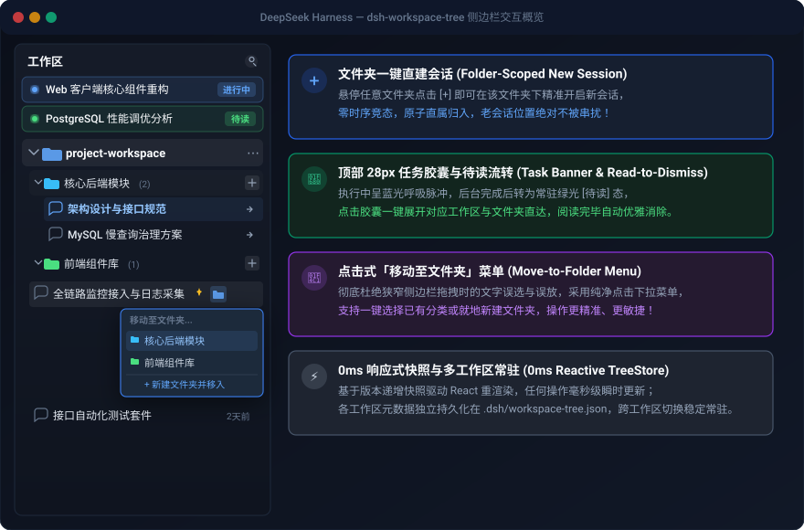
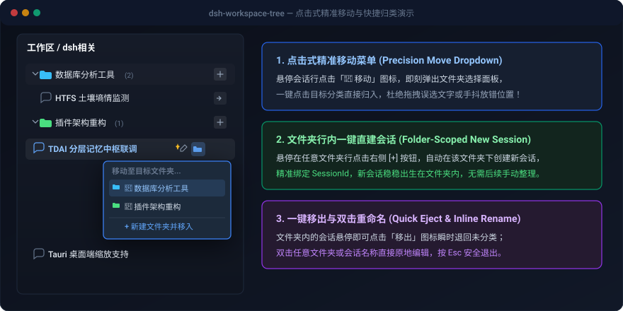
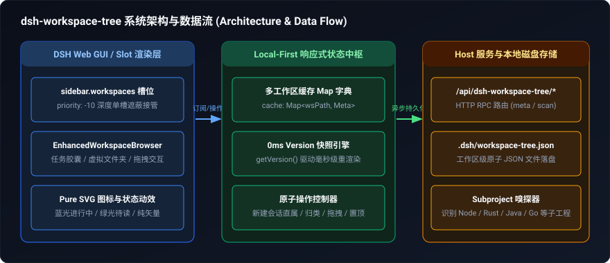

# 🌲 dsh-workspace-tree

<p align="center">
  <strong><a href="./README.md">English</a></strong> | <strong>简体中文</strong>
</p>

> **Virtual Session Folder Grouping, Move-to-Folder Menu, and Nested Workspace Subproject Manager for DeepSeek Harness (DSH).**  
> 为 DeepSeek Harness 打造的原生融合式会话分类树、文件夹管理、点击式移动菜单与嵌套子项目管理器。

[](LICENSE)
[](https://github.com/pipipigu/dsh-workspace-tree)
[](https://www.typescriptlang.org/)
[](https://vitest.dev/)

---

## 📸 界面效果预览 (Visual Previews)

### 1. 侧边栏全景与核心特性概览 (Sidebar Overview)



---

### 2. 点击式精准移动与快捷归类演示 (Move-to-Folder Interaction)



---

## 🌟 核心特性 (Key Features)

- **📁 纯虚拟会话分类文件夹 (Virtual Session Folders)**
  - **零物理侵入**：绝不挪动底层会话文件或目录结构，元数据以极简 JSON 原子持久化于工作区根目录 `.dsh/workspace-tree.json`；
  - **多工作区多路常驻**：每个工作区拥有完全独立的分类树与置顶队列，跨工作区切换时文件夹始终稳固展示，永不闪退或丢失；
  - **分类完整生命周期**：支持一键新建文件夹、双击行内就地重命名、自定义颜色标记及删除（删除文件夹时内部会话安全回退至未分类）。

- **➕ 文件夹一键直建会话 (Folder-Scoped New Session)**
  - 悬停在任意文件夹行上点击 **`[+]`** 按钮，直接在当前工作区启动新会话，并**原子级直属归入该文件夹内部**，杜绝时序竞态与老会话串扰。

- **🚀 顶部进行中/待读任务中枢 (Active Task Banner & Read-to-Dismiss)**
  - **28px 单行精致胶囊**：置顶展示所有正在进行中与已完成待读的会话；
  - **生命周期平滑流转**：生成中呈**蓝光呼吸脉冲** -> 后台完成后平滑转为**绿光常驻 `[待读]` 态** -> 点击阅读或跳转后**自动优雅消除**；
  - **一键直达与展开**：点击胶囊秒级直达会话，并自动联动展开所在工作区与对应文件夹。

- **📂 点击式「移动至文件夹」菜单 (Move-to-Folder Menu)**
  - **零误触设计**：彻底废弃狭窄侧边栏中容易误选文字与手抖放错的拖拽机制，采用纯净点击式下拉菜单；
  - **快速归类与新建**：悬停点击会话行上的「📁 移动」图标，即刻弹出目标文件夹面板，支持一键选择分类或就地新建文件夹并移入；
  - **一键快捷移出**：文件夹内会话提供专属「移出」图标，点击瞬时退回未分类。

- **➕ 顶层工作区新建与添加 (Add Workspace & Directory Picker)**
  - 侧边栏顶部提供 **`[+]` 添加工作区** 按钮；
  - 智能双模支持：优先唤起 OS 系统级目录选择器（原生体验），同时支持就地输入/粘贴绝对路径快速创建工作区。

- **📌 会话置顶、双击重命名与分页流 (Pinning, Inline Rename & Pagination)**
  - 支持会话置顶（置顶会话自动排在最前）；
  - 双击会话行快速激活重命名编辑框；
  - 默认展示最新 10 条会话，底部提供「展开其余 N 个会话」无感按需加载。

- **🎨 原生侧边栏深度接管 (Native Single Slot Shadowing)**
  - 基于 DSH 核心 `sidebar.workspaces` 槽位以 `priority: -10` 无缝深度接管，完美适配 DSH 原生深色/浅色调色板（`--dsw-*`）；
  - 全量采用 **Pure SVG** 矢量图形体系，视觉纯净高雅，杜绝 Emoji 杂乱干扰。

- **⚡ 0ms 版本快照响应式引擎 (0ms Reactive TreeStore)**
  - 采用基于版本递增快照的 `useSyncExternalStore` 响应式状态机，任何移动、重命名、归类操作 **0ms 瞬间触发视图重渲染**。

---

## 📦 安装与启用 (Installation)

### 方式 A：GitHub 一键安装（推荐）

在 DSH 客户端或终端中执行：

```bash
dsh plugin --profile web add github:pipipigu/dsh-workspace-tree
```

重启 DSH Web 实例（或刷新页面）即可体验！

### 方式 B：本地开发与软链调试

```bash
# 1. 克隆仓库
git clone https://github.com/pipipigu/dsh-workspace-tree.git
cd dsh-workspace-tree

# 2. 安装依赖并构建
pnpm install
pnpm build

# 3. 软链挂载至 DSH Web Profile
dsh plugin --profile web add link:$(pwd)
```

---

## 🏗️ 架构与数据流 (Architecture)



---

## 🛠️ 本地开发与指令 (Development)

```bash
# 依赖安装
pnpm install

# 类型检查 (0 错误)
pnpm typecheck

# 单元测试 (Vitest)
pnpm test

# 打包构建 (生成 lib/index.js 与 lib/client.js)
pnpm build
```

---

## 📄 开源协议 (License)

本项目基于 [MIT License](LICENSE) 协议开源。
